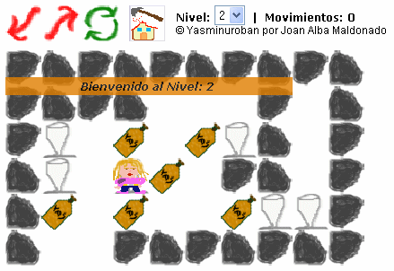

Yasminuroban 
============= 
by [Joan Alba Maldonado](https://joanalbamaldonado.com/) (joanalbamaldonadoNO_SPAM_PLEASE AT gmail DOT com, without NO_SPAM_PLEASE)

Sokoban alike game with level editor totally written in DHTML.

Version: 0.68a 
- Date: 14th March 2006, last changes on 26th July 2006 (approximately).

You can donate at http://sourceforge.net/donate/index.php?group_id=173641

## Description

Open source Sokoban (aka Warehouse keeper) version totally written in DHTML (HTML, CSS and JavaScript). With level editor.

It is my fourth DHTML game and was made in early 2006.

The game includes a level editor and, as far as I know, it is the first level editor ever made using JavaScript. It allows you to modify the current level or create a new one to play it after you press the "Play map" option. You can also copy the generated JavaScript code which can be used to modify the game code by yourself, for example.

You can also change the game behaviour or add new levels easily by editing many of the configuration variables which are at the beginning of the script. To change the game images you just need to replace them with others.

Official languages are Spanish and English.

You can find other modified and adapted versions of this game on the Internet (with configurable skins or themes and with many sets of levels that the player can choose), including one Opera widget.

This game has been tested under BeOS, Linux, NetBSD, OpenBSD, FreeBSD, Windows, Mac OS X and others.

Play online in English: http://yasminuroban.tuxfamily.org/yasminuroban_english/

Play online in English (mirror): http://www.dhtmlgames.com/yasminuroban/yasminuroban_english/

Play online in Spanish: http://yasminuroban.tuxfamily.org/yasminuroban_spanish/

Play online in Spanish (mirror): http://www.dhtmlgames.com/yasminuroban/yasminuroban_spanish/

Official web site: http://yasminuroban.tuxfamily.org/ (mirror at http://www.dhtmlgames.com/yasminuroban/).

## License

This project can be used, reproduced, distributed and modified freely for any non-commercial purposes but always keeping the author's name and copyright clauses. Other than that, just use this project as you wish but never sell it!